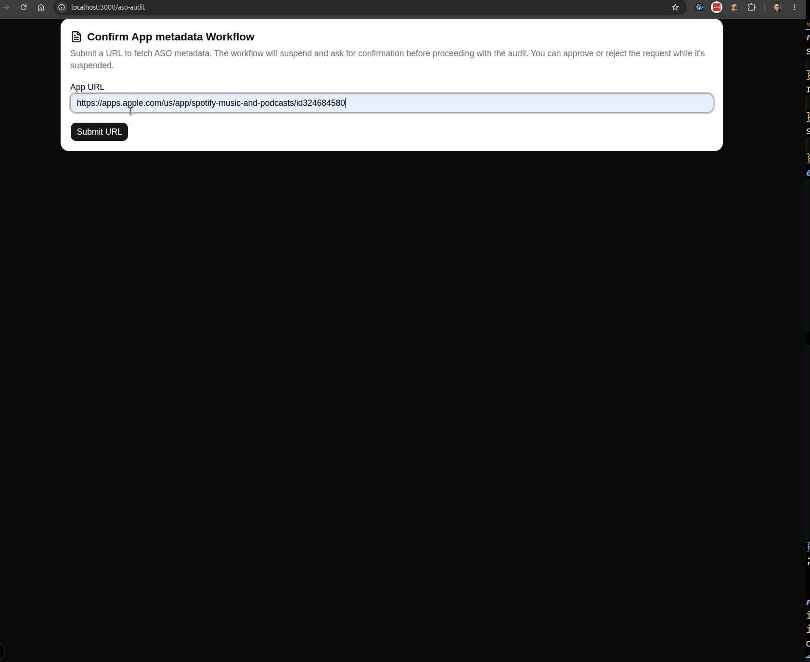
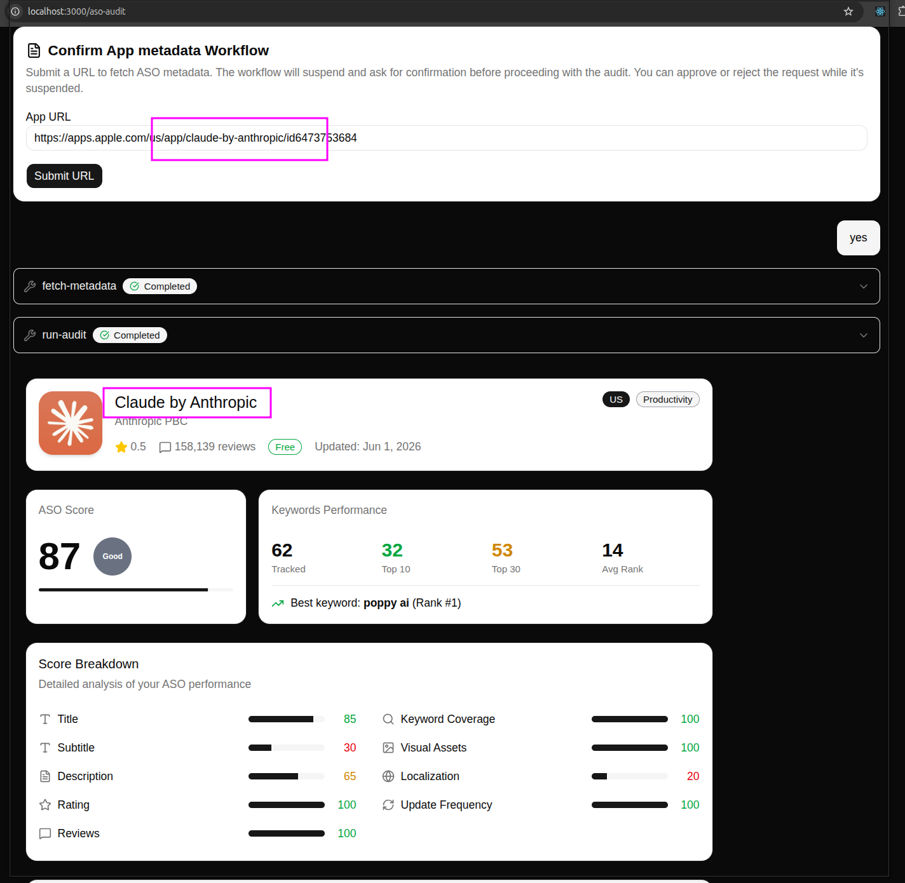
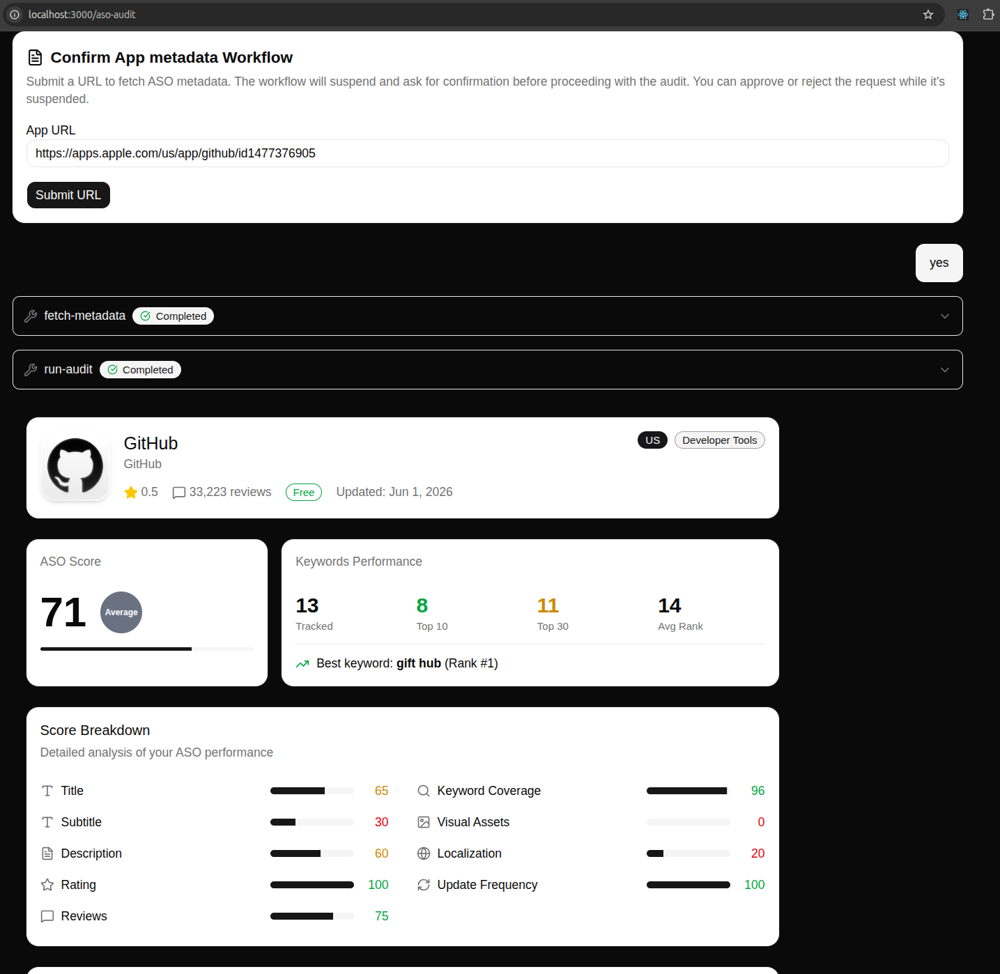

# ASO Audit Agent Challenge

This project is built with **Next.js**, **Shadcn/UI**, **Tailwind CSS**, and the **Mastra Agent Framework** to implement an agentic ASO (App Store Optimization) audit workflow.

## Getting Started

### Project Overview

A few quick notes before jumping in:

1. The application is built on top of a standard Next.js setup using **Shadcn/UI** components and **Tailwind CSS** for styling.
2. Agent workflows are implemented using **Mastra**, with all workflow-related code located under the `src/mastra` directory.
3. Prerequisites:
   - **Node.js 22+** (see `.node-version` and the `engines` field in `package.json`).
   - An **Appeeky API Key** for the ASO Audit endpoint.
     - An example key is included in `.env.example`, but it is limited to roughly 4 requests under the free plan.
     - If you'd like to run additional audits, create your own API key from: https://dashboard.appeeky.com/dashboard and add it to your local `.env` file.

---

## Running the Project Locally

### Start the Application

Both the **Next.js application** and the **Mastra development server** must be running.

To simplify this, the repository includes a convenience script:

```bash
npm run start:workflow
```

This starts both services concurrently.

### Access the UI

Once everything is up and running, navigate to:

```text
http://localhost:3000/aso-audit
```

You'll be greeted by a chat-style interface that serves as the entry point for interacting with the ASO Audit Agent.

### Workflow Walkthrough

1. Submit an App Store URL (the challenge examples work great).
2. For testing purposes, you can use:

```text
https://apps.apple.com/us/app/spotify-music-and-podcasts/id324684580
```

3. The workflow extracts the app information and then enters a **suspended state**, waiting for user confirmation.
4. You'll be presented with a prompt similar to:

```text
Is this the app you meant?
```

5. Two actions are available:
   - **Confirm** → The workflow resumes and generates the ASO audit report.
   - **Reject** → The workflow exits gracefully via `bail()`, marking execution as successfully completed without producing a report.

### Performance Note ⏳

<mark>The Appeeky ASO Audit endpoint can be fairly slow.</mark>

During testing, response times typically ranged between **40–60 seconds** before the audit data became available. The upside is that the returned dataset is quite comprehensive, so a little patience goes a long way.

---

## Workflow Demo

<details>
  <summary>Click to view the workflow walkthrough</summary>



_This example completes a bit faster than usual, likely because Spotify was used repeatedly during development and the upstream data may have been cached._

</details>

---

## Additional Notes

The React component used to render the ASO Audit report was initially scaffolded using **Vercel v0** and then integrated into the application workflow.

**v0 Component Reference**

https://v0.app/renato1010/chat/nextjs-shadcn-component-mig1UYrAE1L

---

## Listings URLs tested

App Store listings tested during development:  
-BI(GT)Local bank: https://apps.apple.com/us/app/bi-en-l%C3%ADnea/id510761055  
-Spotify: https://apps.apple.com/us/app/spotify-music-and-podcasts/id324684580  
-github: https://apps.apple.com/us/app/github/id1477376905  
-claude: https://apps.apple.com/us/app/claude-by-anthropic/id6473753684  
-deepseek: https://apps.apple.com/us/app/deepseek-ai-assistant/id6737597349  
-linkedin: https://apps.apple.com/us/app/linkedin-community-network/id288429040

<details>
  <summary>Click to view Claude ASO Audit report</summary>



  </details>

<details>
  <summary>Click to view Github ASO Audit report</summary>



  </details>


